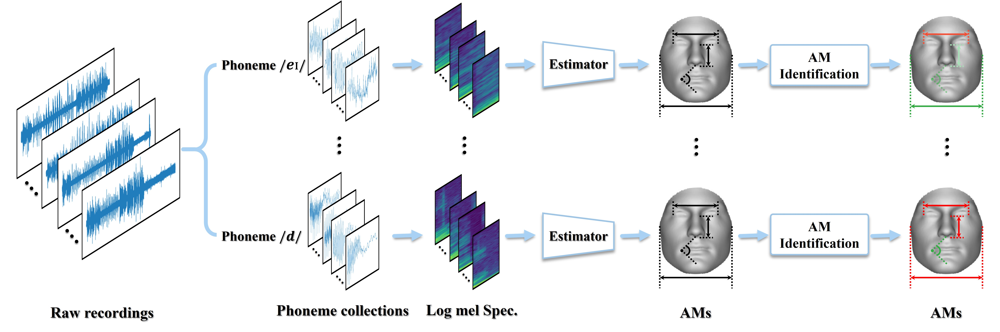

> ## [The Hidden Dance of Phonemes and Visage: Unveiling the Enigmatic Link between Phonemes and Facial Features](https://arxiv.org/abs/2307.13953)
> **Authors:** *Liao Qu*\*, *Xianwei Zou*\*, *Xiang Li*\*, Yandong Wen, Rita Singh, Bhiksha Raj  
\* *indicates co-first author*


## Abstract
This work unveils the enigmatic link between phonemes and facial features. Traditional studies on voice-face correlations typically involve using a long period of voice input, including generating face images from voices and reconstructing 3D face meshes from voices. However, in situations like voice-based crimes, the available voice evidence may be short and limited. Additionally, from a physiological perspective, each segment of speech -- phoneme -- corresponds to different types of airflow and movements in the face. Therefore, it is advantageous to discover the hidden link between phonemes and face attributes.

In this paper, we propose an analysis pipeline to help us explore the voice-face relationship in a fine-grained manner, i.e., phonemes vs. facial anthropometric measurements (AM). We build an estimator for each phoneme-AM pair and evaluate the correlation through hypothesis testing. Our results indicate that AMs are more predictable from vowels compared to consonants, particularly with plosives. Additionally, we observe that if a specific AM exhibits more movement during phoneme pronunciation, it is more predictable. Our findings support those in physiology regarding correlation and lay the groundwork for future research on speech-face multimodal learning.

<p style="text-align:center;"></p>

## News
- (2023-11-6) Code released.
- (2023-05-17) Accepted to **[Interspeech 2023](https://interspeech2023.org/)**!


## Requirements and Installation

Before installing the project, please ensure your system meets the following requirements:

- Python >= 3.7 (version 3.9.13 recommended)
- PyTorch >= 1.12.0 (version 1.12.1 recommended)
- CUDA Version >= 11 (version 11.6 recommended)
- Numpy Version >= 1.23.0
- Pandas Version >= 2.1.0

To install and set up your development environment, follow the steps below:

```bash
# Clone the repository
git clone git@github.com:Oscarwasoccupied/Interspeech23_Phonemes_and_Visage.git

# Navigate to the repository directory
cd Interspeech23_Phonemes_and_Visage

# Install required Python packages
pip install -r requirements.txt
```

## Citation

Liao Qu, Xianwei Zou, Xiang Li, Yandong Wen, Rita Singh, and Bhiksha Raj. "The Hidden Dance of Phonemes and Visage: Unveiling the Enigmatic Link between Phonemes and Facial Features." 2023. arXiv preprint arXiv:2307.13953.

## BibTeX

To cite this paper in your academic work, you can use the following BibTeX entry:

```bibtex
@misc{qu2023hidden,
  title={The Hidden Dance of Phonemes and Visage: Unveiling the Enigmatic Link between Phonemes and Facial Features},
  author={Qu, Liao and Zou, Xianwei and Li, Xiang and Wen, Yandong and Singh, Rita and Raj, Bhiksha},
  year={2023},
  eprint={2307.13953},
  archivePrefix={arXiv},
  primaryClass={cs.CV}
}

