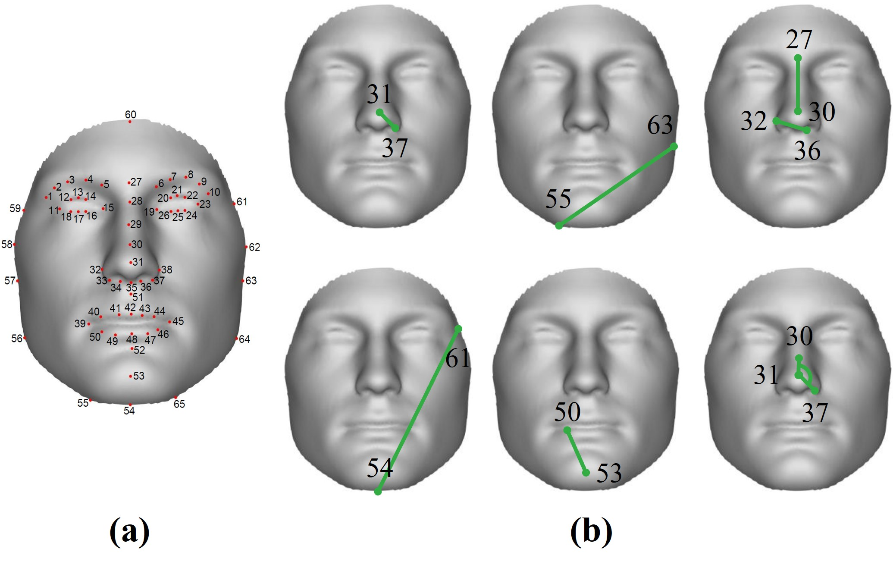

# Dataset Description

Due to our collaboration with Penn State University, the dataset utilized in this project is not publicly available for distribution. However, we provide a detailed description below to give insight into its composition and structure:

## Dataset Overview

The dataset comprises audio recordings and facial data from a total of 1,026 individuals, consisting of 364 males and 662 females. Each participant contributed to the dataset in two significant ways:

### Audio Recordings
- **Content:** Each individual speaks identical content in English, encompassing a range of linguistic elements such as phonetic symbols, letters, words, and sentences.
  
### Facial Data
- **Data Points:** The dataset includes detailed facial data for each participant, represented by 6,790 3D coordinate points collected from their faces.
- **Data Extraction:**
  - From these 6,790 points, we extract a subset of 65 points, as illustrated in the image below. This subset is crucial for our analysis.
  - For information on how to handle and extract facial data, refer to the script located at `/scripts/Extract_AM_points.py`.
  

